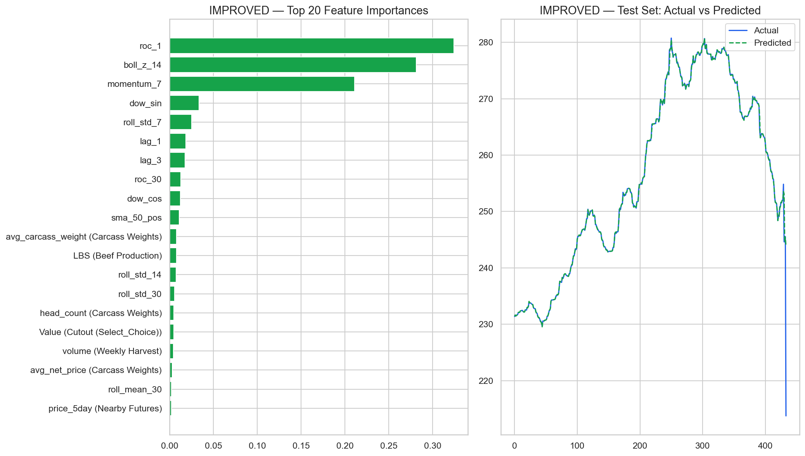

# Ag Market Predictor Dashboard

A locally-run Streamlit application for cross-market agricultural commodity analysis and prediction, built for the Syracuse iSchool CCDS and Professional Ag Marketing Pro-Ag Data Science Competition. It pairs an XGBoost forecasting engine with a fully offline, locally-hosted LLM for explainable market briefings.

## Overview

The dashboard ingests 29 proprietary commodity datasets (roughly 60MB spanning 2001 to 2025) covering cattle, hogs, futures, cutout values, harvest and production, and macroeconomic indicators, and presents them through a seven-tab interface for exploration, correlation discovery, model training, and AI-generated briefings. Everything, including the language model, runs entirely on the local machine, so proprietary data never leaves it.

## Key results

- Corrected a broken prediction baseline from a test R-squared of -0.97 to 0.99 through data-leakage sanitization, returns-based targeting, regularization, and trend-aware features (Bollinger Bands, SMA position, momentum, ROC)
- 78.5 percent directional accuracy on price movement
- Time-series cross-validation to prevent look-ahead bias
- Offline explainable-AI briefings via a local Llama 3 8B model, optionally enriched with live FRED macro indicators (Corn PPI, WTI, Fed Funds Rate, CPI, USD Index)



*Top feature importances (left) and the held-out test set, actual versus predicted (right). The full set of figures is in `notebook_outputs/`, and the complete write-up is in `Ag_Market_Predictor_Report.pdf`.*

## The seven tabs

Market Overview, Cash and Cutout, Futures, Correlations, Predictive Engine, AI Briefing, and Debug.

## Tech stack

Python, Streamlit, XGBoost, scikit-learn, pandas, Plotly, Llama.cpp (local Llama 3 8B, GGUF), and the FRED API.

## Repository structure

```
app.py                              # Streamlit entry point (7-tab layout)
requirements.txt
tabs/                               # One module per tab
  tab_overview.py
  tab_cash_cutout.py
  tab_futures.py
  tab_correlations.py
  tab_predictor.py
  tab_briefing.py
  tab_debug.py
shared/                             # Shared engine and data loaders
  analytics.py                      # XGBoost engine, feature engineering, cross-validation
  data_loader.py                    # Ingests and cleans the commodity datasets
  fred_loader.py                    # Optional FRED macro-indicator merge
  constants.py                      # Configuration and shared constants
run_analysis.py                     # Standalone analysis and figure generation
01_exploratory_and_baseline.ipynb   # Exploratory analysis and baseline modeling
notebook_outputs/                   # Generated figures and analysis log
Ag_Market_Predictor_Report.pdf      # Full written report
```

## What is needed to run it

1. Python 3.10 or higher
2. The proprietary `ProAg_data` folder placed in the parent directory of this project (for example, `../pro_ag_comp/ProAg_data`). It is not included in this repository for privacy reasons.
3. Python dependencies, installed via `requirements.txt`
4. A FRED API key, for fetching real-time macroeconomic indicators (Corn PPI, Fed Funds Rate, and so on)
5. A GGUF model file, for running the local AI market briefing generator entirely offline

## Setup instructions

### 1. Install dependencies

From the root directory of this project, run:

```bash
pip install -r requirements.txt
```

### 2. Get a FRED API key

1. Go to the Federal Reserve Economic Data (FRED) API website: https://fred.stlouisfed.org/docs/api/api_key.html
2. Create a free account and request an API key.
3. Set the key as an environment variable before running the dashboard:
   - Mac/Linux: `export FRED_API_KEY="your_api_key_here"`
   - Windows (Command Prompt): `set FRED_API_KEY="your_api_key_here"`
   - Windows (PowerShell): `$env:FRED_API_KEY="your_api_key_here"`

### 3. Download the local GGUF model

The application uses a local quantized large language model to generate offline market briefings without uploading proprietary data to the cloud.

1. Download `Meta-Llama-3-8B-Instruct.Q4_K_M.gguf` from HuggingFace (for example, the lmstudio-community Meta-Llama-3-8B-Instruct-GGUF repository).
2. Create a `models` directory inside this project folder.
3. Place the downloaded `.gguf` file inside the `models` directory.

## How to run it

Once dependencies are installed, the `ProAg_data` folder is in the parent directory, and the API key is configured, launch the dashboard with:

```bash
streamlit run app.py
```

The application opens in your default browser at `http://localhost:8501`.

## Author

Jacob VonTersch. Syracuse University, CCDS Pro-Ag Data Science Competition, 2026.
